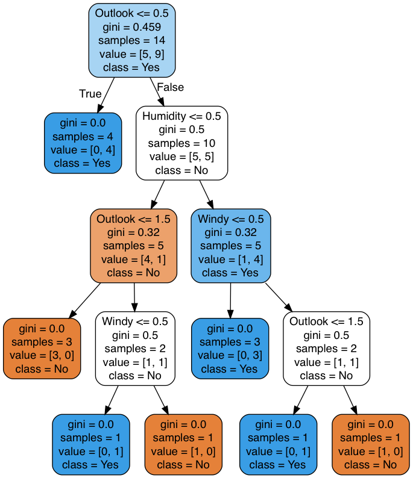

## Purpose

	This project demonstrates how to train a decision tree using entropy and gini index and visualize the tree in PNG under Jupyter notebook.

## Environment
	
	Python 3 (Anaconda 3, Jupyter Notebook)
	Pandas, SciKit-Learn
	pydotplus for turning the decision tree to PNG

## Input - weather_normal.csv dataset

## Output 1 - Decision Tree with Entropy

## Output 2 - Decision Tree with Gini Index

